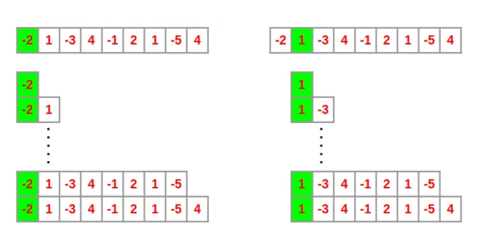
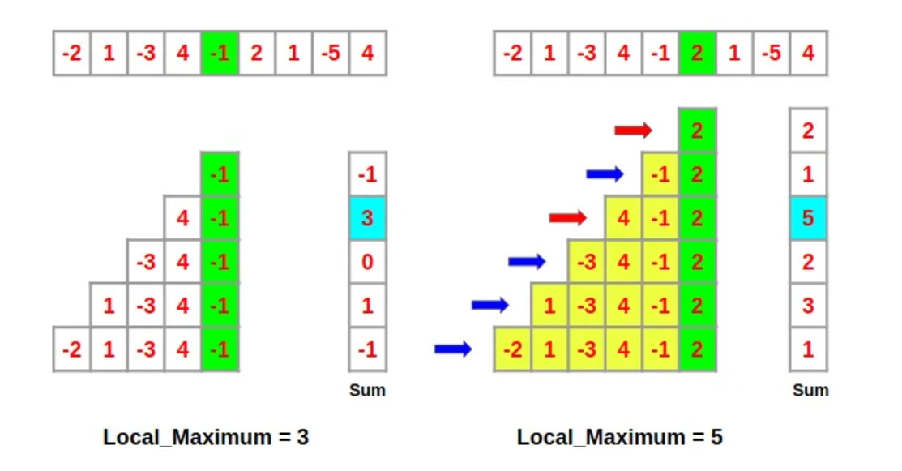

# **NALOGE IZ DINAMIČNEGA PROGRAMIRANJA**
* Adnan Pajalić
* Jernej Renčelj
* Tom Rupnik Medjedovič

## **Naloga 1(a)**

**Navodilo:**

Podan imamo seznam, ki lahko vsebuje števila, ki niso nujno cela in so lahko pozitivna, negativna ali enaka 0. Naša naloga je:

* Opisati in analizirati algoritem, ki poišče največjo vsoto v zaporednem podseznamu danega seznama.

### **Naivna rešitev:**

BRUTE FORCE PRISTOP:

Poiščemo vsote vseh možnih zaporednih podseznamov in med njimi poiščemo maksimalnega. Izberemo si $i$-ti element v seznamu, ki predstavlja prvo število trenutne vsote in postopoma dodajamo elemente vse do $n$-tega. S tem dobimo lokalni maksimum $i$-te vsote. Naj bo lokalni maksimum, maksimum vsote vseh možnih podseznamov, ki se začnejo z elementom $A[i]$. Ko pregledamo vse indekse od 1 do $n$, imamo shranjene vse lokalne maksimume za vse indekse. Vzamemo maksimum od vseh lokalnih maksimumov in dobimo rešitev. 

Vendar ta pristop ni najbolj optimalen. Z večanjem seznama se veča množica vseh podseznamov in stem se časovna zahtevnost povečuje. Časovna zahtevnost je torej zaradi dveh gnezdenih zank $O(n)$. Poglejmo si kako bi lahko izboljšali algoritem.

KADANOV ALGORITEM:

Tokrat začnemo z iskanjem največje vsote podseznama od zadnjega elementa seznama. Poglejmo si podsezname, ki se končajo z $A[i]$-tim elementom. Recimo, da poznamo lokalni maksimum $i$-tega indeksa. Sedaj želimo izračunati lokalni maksimum $i+1$-ga indeksa. Za izračun le tega ni potrebno izračunati vsot vseh podseznamov do $i+1$-ga indeksa, saj že poznamo izračunane vsote podseznamov do $i$-tega. Zanima nas torej samo vrednost največje vsote do $i$-tega podseznama. Ta ideja nas vodi do principa na kakršen deluje Kadanov algoritem. 

$$lokalni_\ maksimum[i] = max(A[i], A[i] + lokalni_\ maksikum[i-1])$$

Na ta način na vsakem indeksu $i$ problem prevedemo na iskanje maksimuma dveh števil, $A[i]$ in ($A[i]$ + $lokalni_\ maksimum[i-1]$). Velja tudi, da je $lokalni_\ maksimum[0]$ enak $A[0]$.

Na ta način moramo po seznami iterirati zgolj enkrat, kar je torej bistveno hitreje kot na prvi opisan način. Časovna zahtevnost Kadanovega algoritma je $O(n)$.

**VIRI:** https://medium.com/@rsinghal757/kadanes-algorithm-dynamic-programming-how-and-why-does-it-work-3fd8849ed73d

---

## **Naloga 1(b)**

**Navodilo:**

Podan imamo seznam, ki lahko vsebuje števila, ki niso nujno cela in so lahko pozitivna, negativna ali enaka 0. Naša naloga je:

* Opisati in analizirati algoritem, ki poišče največji produkt v zaporednem podseznamu danega seznama.

BRUTE FORCE PRISTOP:

Naivna rešitev je, da poiščemo vse produkte podseznamov, ki imajo za prvi element i-ti člen. Tako bi izračunali lokalni maksimum, ter na koncu primerjali vrednosti in izmed njih dobili globalni maksimum. Časovna zahtevnost takega algoritma je $O(n^2)$.

DINAMIČNA REŠITEV:

Na vsakem koraku si zapomnimo minimalni in maksimalni produkt podseznamov, ki se končajo z $i$-tim členom prvotnega seznama. V primeru da je $i+1$ element negativen je $min\_ prod(i)*sez[i+1]$ lahko največji produkt in $max\_ prod(i)*sez[i+1]$ postane minimalni produkt. Torej ključna ideja je na vsakem hraniti vrednost $min\_ prod$ in $max\_ prod$.

Na vsakem koraku imamo tri možnosti kako dobit največji produkt podseznama, ki se konča z $i$-tim elementom:
* Če je novi (zadnji/$i$-ti) element pozitivno število bomo lahko maksimalni produkt dobili tako da novi element pomnožimo z $max\_ prod(i-1)$
* Če je  novi (zadnji/$j$-ti) element negativno število bomo lahko največji produkt dobili tako da novi element pomnožimo z $min\_ prod(j-1)$
* Trenutni element je začetni element za največji produkt (v primeru da je $j-1$ element 0 ali $j=0$)

Torej:
* V $max_\ globalni$ si najprej spravimo vrednost $sez[0]$
* Na vsakem koraku spremenimo vrednosti $max_\ i$ ter $min_\ i$\
$max\_ i = max(max\_i * sez[j], sez[j])$\
$min_i = min(min\_ i * sez[j], sez[j])$
* V primeru da je $j$-ti element negativno število vrednoti zamenjamo $max\_ i = min\_ i in min\_ i = max\_ i$
* Na vsakem koraku preverimo $max\_ globalni = max(max\_ i, max\_ globalni)$

Časovna zahtevnost tega algoritma je $O(n)$.
