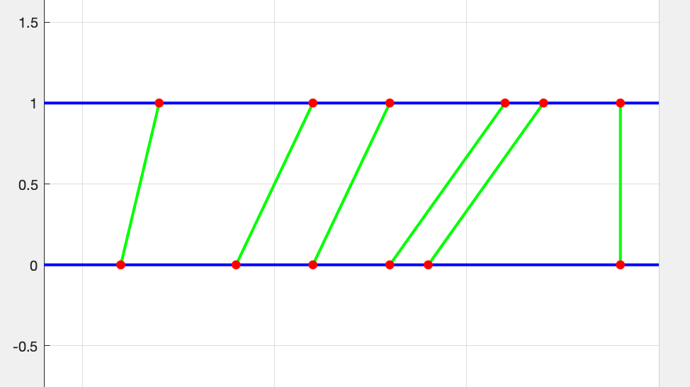
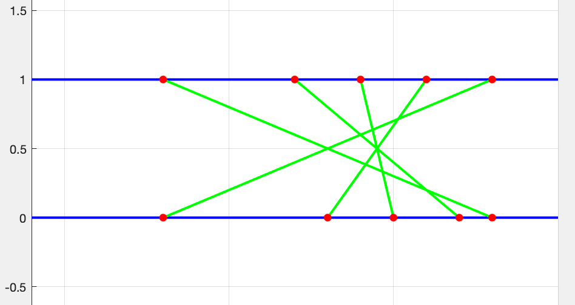

<h1 align="center"> REŠITVE </h1>

# Naloga 1
el|| -2|3|5|-6|-4|5|-13|2|1|7|-5|-7|3|8|-30|-13|7
|:--:|:--:|:--:|:--:|:--:|:--:|:--:|:--:|:--:|:--:|:--:|:--:|:--:|:--:|:--:|:--:|:--:|:--:|:--:|
novi element|| -2|3|5|-6|-4|5|-13|2|1|7|-5|-7|3|8|-30|-13|7|
max prej. + el||-2|1|8|2|-2|3|-8|-6|3|10|5|-2|1|11|-19|-32|-6
lok. max ||-2|3|8|2|-2|5|-8|2|3|10|5|-2|3|$$\color{red}11$$|-19|-13|7

___
___

# Naloga2

el||3|-3|-5|2|-1|-2|3|-2
|:--:|:--:|:--:|:--:|:--:|:--:|:--:|:--:|:--:|:--:|
lok. max||3|-3|45|90|10|180|540|120|
lok. min||3|-9|-5|-10|-90|-20|-60|-1080|
max||3|3|45|90|90|180|$$\color{red}540$$|540

___
___

# Naloga 3

## 3.1

Dolžina najdaljšega naraščajočega podzaporedja je 6. ([2, 6, 8, 11, 12, 14])

## 3.2

Dolžina najdaljšega padajočega podzaporedja je 5. ([13, 11, 9, 7, 3])

