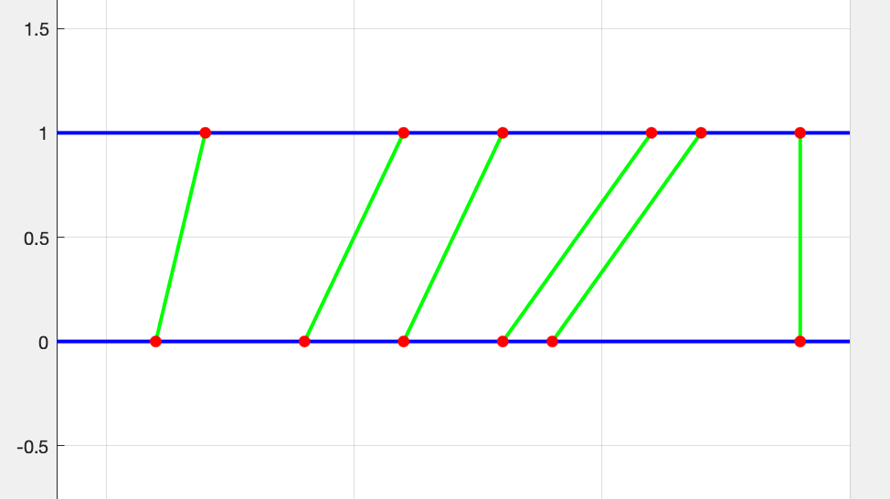
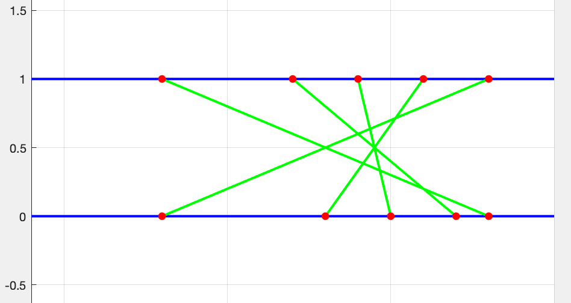

<h1 align="center"> REŠITVE </h1>

# Naloga 1
el|| -2|3|5|-6|-4|5|-13|2|1|7|-5|-7|3|8|-30|-13|7
|:--:|:--:|:--:|:--:|:--:|:--:|:--:|:--:|:--:|:--:|:--:|:--:|:--:|:--:|:--:|:--:|:--:|:--:|:--:|
novi element|| -2|3|5|-6|-4|5|-13|2|1|7|-5|-7|3|8|-30|-13|7|
max prej. + el||-2|1|8|2|-2|3|-8|-6|3|10|5|-2|1|11|-19|-32|-6
lok. max ||-2|3|8|2|-2|5|-8|2|3|10|5|-2|3|$$\color{red}11$$|-19|-13|7

___
___

# Naloga2

el||3|-3|-5|2|-1|-2|3|-2
|:--:|:--:|:--:|:--:|:--:|:--:|:--:|:--:|:--:|:--:|
lok. max||3|-3|45|90|10|180|540|120|
lok. min||3|-9|-5|-10|-90|-20|-60|-1080|
max||3|3|45|90|90|180|$$\color{red}540$$|540

___
___

# Naloga 3

## 3.1

Dolžina najdaljšega naraščajočega podzaporedja je 6. ([2, 6, 8, 11, 12, 14])



## 3.2

Dolžina najdaljšega padajočega podzaporedja je 5. ([13, 11, 9, 7, 3])



# Naloga 4
``` python
def lisjak(tabela):
    n = len(tabela) - 1
    memo = {}

    def vrednost(i, izreci):
        vsota = 0
        for j in range(i, len(izreci) + i):
            if izreci[j - i] == 'D':
                vsota -= tabela[j]
            elif izreci[j - i] == 'R':
                vsota += tabela[j]
        return vsota
    
    def pomozna(i, ring, ding):
        if i > n:
            return []
        if (i, ring, ding) in memo:
            return memo[(i, ring, ding)]
        if ring == 3:
            r = ['D'] + pomozna(i + 1, 0, ding + 1)
            d = ['D'] + pomozna(i + 1, 0, ding + 1)
        elif ding == 3:
            d = ['R'] + pomozna(i + 1, ring + 1, 0)
            r = ['R'] + pomozna(i + 1, ring + 1, 0)
        else:
            r = ['R'] + pomozna(i + 1, ring + 1, 0)
            d = ['D'] + pomozna(i + 1, 0, ding + 1)
        vrednost_r = vrednost(i, r)
        vrednost_d = vrednost(i, d)
        if vrednost_r > vrednost_d:
            memo[(i, ring, ding)] = r
        else:
            memo[(i, ring, ding)] = d
        return memo[(i, ring, ding)]
    return pomozna(0, 0, 0)
```

